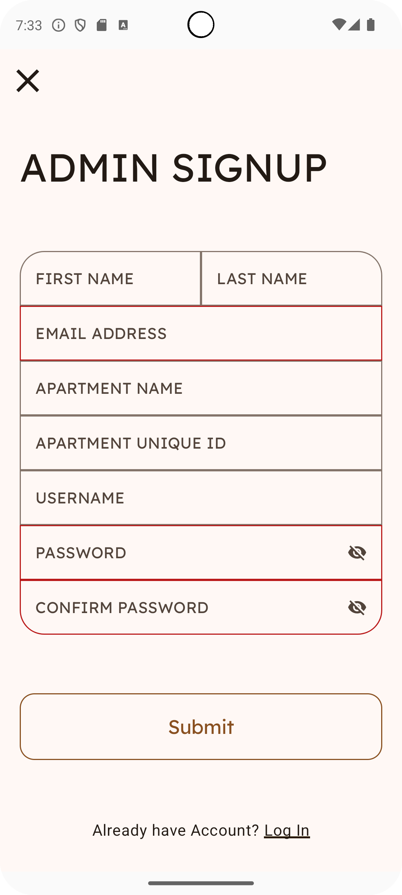
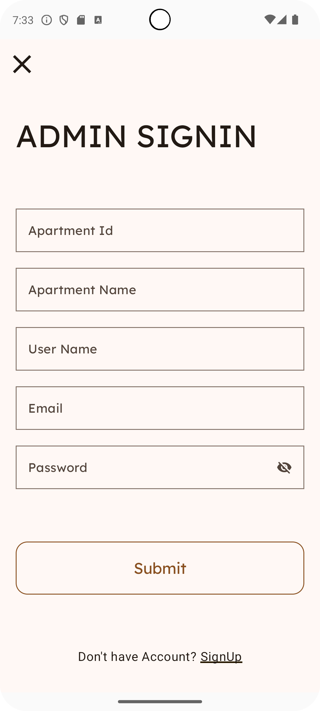
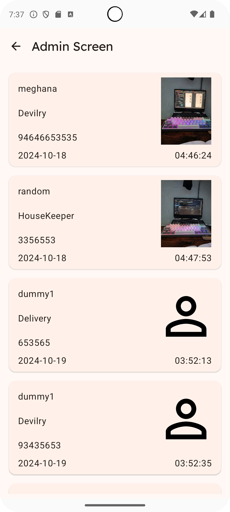
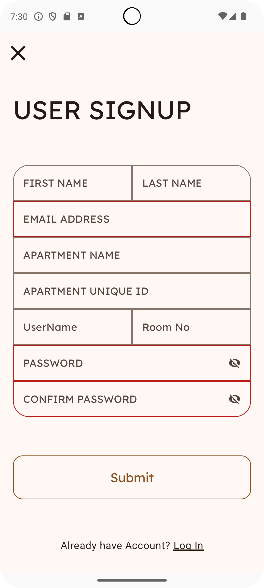
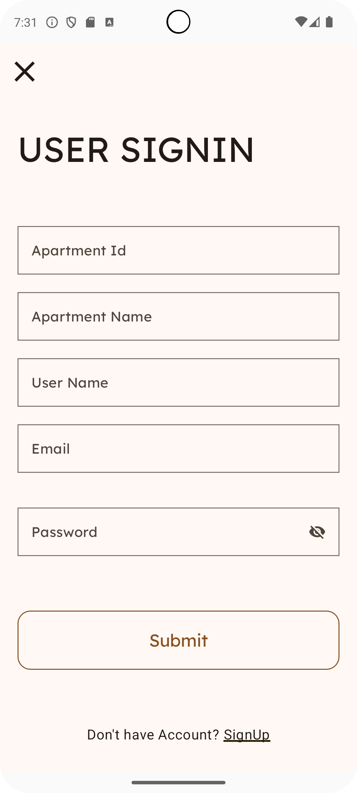
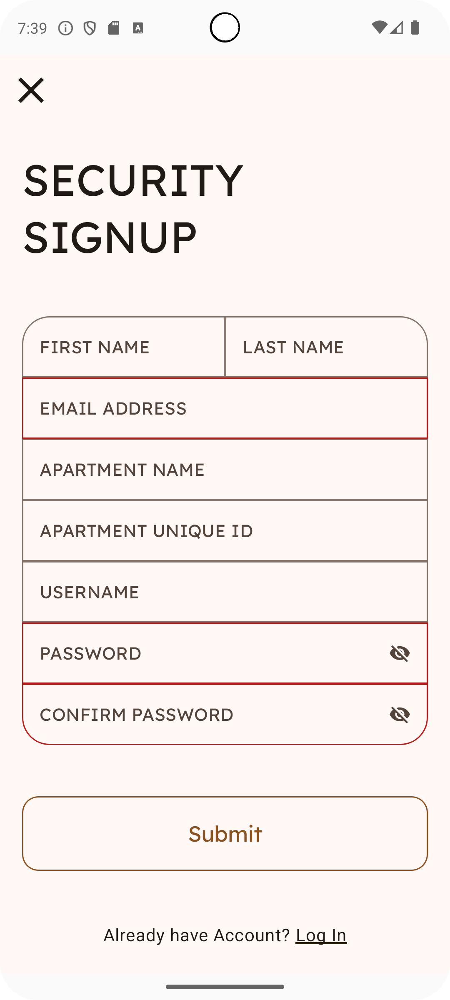
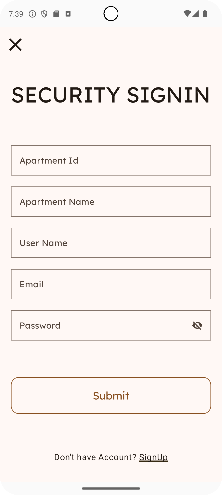
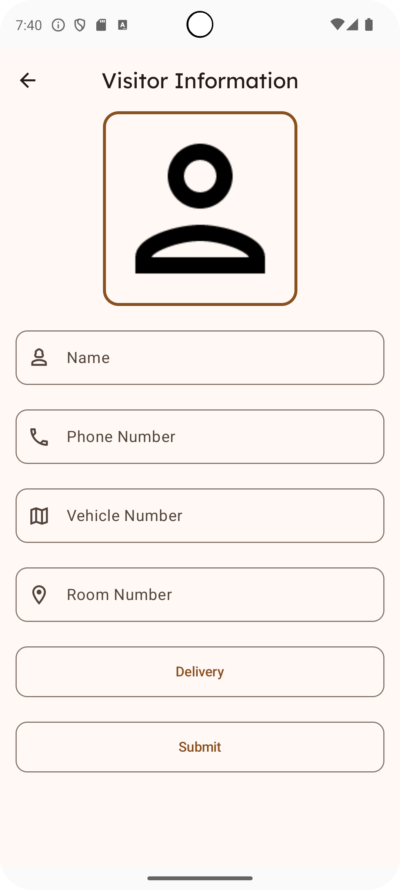

# Apartment Security App 🚪🔒

A modern Android application designed to enhance apartment security by enabling efficient visitor management and real-time monitoring using Jetpack Compose and Firebase.

## 🌟 Features
- **Visitor Management**: Log visitor details with images using the Coil library.
- **Multi-Authentication**: Secure user authentication via Firebase.
- **Live Monitoring**: Access real-time visitor data.
- **Modern UI**: Built with Jetpack Compose for smooth and responsive user experience.

## 🛠️ Technologies Used
- **Kotlin** with Jetpack Compose
- **MVVM Architecture**
- **Firebase Authentication** and **Firestore**
- **Coil Library** for image handling

## 🚀 Getting Started
1. Clone the repository:
   ```bash
   git clone https://github.com/Bhargav200004/ApartmentSecurity.git

2. Open in Android Studio.
3. Configure Firebase:
   - Add your google-services.json to the project.
   - Set up Firebase Authentication and Firestore.
4. Run the app on an emulator or device.

## 📸 Screenshots

### Admin Screen
|  |  |
|:------------------------------------------------------------------:|:-------------------------------------------------------------------:|
|    |

### User Screen
|  |  |
|:------------------------------------------------------------------:|:-------------------------------------------------------------------:|

### Security Screen
|  |  |
|:------------------------------------------------------------------:|:-------------------------------------------------------------------:|
|    |

## 🎥 Demo Video
https://github.com/user-attachments/assets/156a2cf6-e9ab-4253-a783-38117a125cb0


## 🤝 Contributing
Contributions are welcome! Feel free to fork this repository and submit pull requests.

